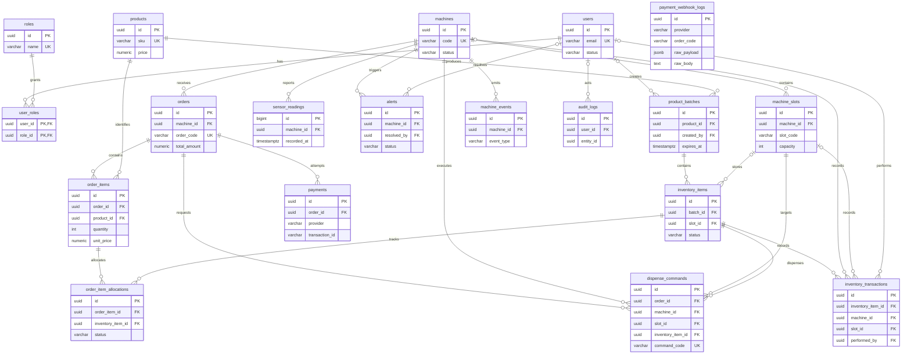

# Database migration — Fruit Machine

Phạm vi: PostgreSQL 18, Flyway SQL, seed development và kiểm chứng database.
Entity JPA và bootstrap Spring Boot đã được bổ sung trong bước tiếp theo:
[jpa-entities.md](jpa-entities.md). Chưa triển khai repository, service, controller, auth, MQTT
hay payment integration. Các SQL migration trong tài liệu này giữ nguyên.
Root repository chứa thư mục `backend/`; resource thực tế là
`backend/src/main/resources/db/migration/`.

## 1. Phân tích và quyết định thiết kế

1. Một `inventory_items` là đúng một tô, thuộc một batch. Bỏ `machine_id` khỏi bảng này:
   máy được suy ra qua `slot_id → machine_slots.machine_id`. `slot_id` NULL trước khi nạp;
   AVAILABLE trong kho chưa đồng nghĩa với hàng có thể bán tại máy. Khi bán/loại bỏ giữ
   slot cuối để truy vết. Không dùng quantity trên slot làm tồn kho.
2. `order_items.quantity` có thể lớn hơn 1, nên không đặt một `inventory_item_id` ở đây.
   `order_item_allocations` liên kết từng tô với dòng đơn, có RESERVED / DISPENSED / RELEASED.
   Partial UNIQUE ngăn cấp phát đồng thời và tái bán tô đã nhả. Hủy đặt trước chuyển RELEASED,
   lưu thời điểm; lần đặt tiếp theo tạo dòng mới. Số dòng phân bổ, đúng sản phẩm và đúng máy
   là quy tắc cross-table của service.
3. `dispense_commands` giữ các khóa yêu cầu của prompt. Composite FK kiểm tra order–machine,
   slot–machine và inventory–slot. Các UNIQUE `(id, machine_id)` và `(id, slot_id)` là đích
   cần thiết cho FK; không tạo index lặp lại. Service phải kiểm tra command khớp allocation
   đang hoạt động của chính order đó.
4. `inventory_transactions.machine_id/slot_id` là snapshot vị trí tại sự kiện. Composite FK
   MATCH FULL bảo đảm cả hai NULL hoặc slot thuộc máy đó. LOAD / RESERVE / SALE phải có vị trí.
   `reference_id` là tham chiếu đa hình nên không FK; service quy định reference theo type
   (ví dụ SALE → order).
5. `unit_price` và `total_price` lưu giá chốt, không đọc giá hiện tại của sản phẩm.
   CHECK `total_price = quantity * unit_price`; tổng dòng và tổng order do service bảo đảm.
   Tiền dùng NUMERIC(12,2), không âm; upper bound loại cả NaN. Thiết kế hiện dùng một tiền tệ
   VND toàn hệ thống; bổ sung currency bằng migration nếu cần nhiều tiền tệ.
6. Payment có nhiều attempts trên cùng order; không UNIQUE(order_id). Transaction ID chỉ
   UNIQUE theo `(provider, transaction_id)` khi không NULL. Đây phải là mã giao dịch tài chính
   riêng của provider, không phải mã order/request có thể dùng lại. `payment_reference`
   không UNIQUE vì semantics chưa có hợp đồng provider xác định. Không giới hạn một SUCCESS:
   hai attempts có thể thực sự cùng thu tiền; service phải ghi nhận cả hai và đối soát/hoàn tiền,
   không bỏ mất giao dịch thứ hai.
7. Provider và machine event type là vocabulary mở. Status/type đã quy định dùng VARCHAR + CHECK,
   không dùng PostgreSQL ENUM. Thay đổi vocabulary đóng bằng migration mới.
8. Webhook giữ `raw_payload` JSONB nullable và thêm `raw_body` TEXT NOT NULL để lưu nguyên văn
   dữ liệu nhận được, kể cả JSON/chữ ký lỗi. JSONB không giữ byte gốc để kiểm chữ ký.
   `order_code` không FK để lưu callback cho order chưa biết; signature TEXT không cắt dữ liệu dài.
   Không UNIQUE webhook: giữ mọi callback để audit; xử lý idempotent ở service.
9. FK nghiệp vụ dùng ON DELETE RESTRICT để giữ lịch sử. Cascade duy nhất là users → user_roles
   (membership). Roles có thể mở rộng; ADMIN và STAFF được seed cố định trong V8, không account.
10. Inventory history có một statement trigger nhỏ chặn UPDATE / DELETE / TRUNCATE: lý do cụ thể
    là bảo đảm yêu cầu append-only. Sửa sai bằng ADJUSTMENT mới. Không có workflow trigger,
    trigger kiểm hết hạn, tính tồn kho hay tự cập nhật timestamp. Owner/superuser vẫn có thể
    tắt trigger; runtime role cần chỉ được INSERT/SELECT history và không sở hữu schema.
11. Sensor dùng BIGINT GENERATED ALWAYS AS IDENTITY; recorded_at là event time, không thêm
    created_at. B-tree `(machine_id, recorded_at DESC)` cho latest/range per-machine;
    BRIN(recorded_at) cho khoảng thời gian toàn hệ thống khi ingest gần thứ tự thời gian.
    Chưa partition trước khi có lưu lượng/retention thực tế; heavy backfill giảm lợi ích BRIN.
12. Nullable: batch creator, alert resolver, actor audit/history cho tác vụ hệ thống, vị trí hàng
    chưa nạp và snapshot history ngoài máy. Các quan hệ bắt buộc còn lại dùng NOT NULL.
    Miền môi trường là -100..100 °C và 0..100 %RH, min ≤ max; cần migration nếu thiết bị vượt miền.

Không dùng CHECK dựa trên `now()` để bảo đảm hết hạn: CHECK chỉ chạy khi ghi, không tự đánh giá
lại khi đồng hồ trôi, và expires_at nằm ở batch. Service kiểm hết hạn khi reserve, xác nhận
payment và trước gửi command, trong transaction với row lock. Schema hỗ trợ truy vấn chính xác
bằng expires_at, nhưng **không tự chặn SQL trực tiếp bán hàng hết hạn**. Đây là ranh giới chủ ý
theo yêu cầu không xây workflow trigger.

## 2. ERD cuối cùng



Webhook logs độc lập với payment/order ở cấp FK: đối soát bằng provider, order_code và
transaction ID trong payload. Audit entity_id là tham chiếu đa hình không FK.

## 3. Danh sách bảng, quan hệ và data dictionary

Mọi `id` là UUID DEFAULT gen_random_uuid(), trừ sensor identity; user_roles dùng PK kép.
Timestamp dùng TIMESTAMPTZ; created_at và updated_at (nếu có) NOT NULL có default.
Mapping JPA dùng Spring Data auditing @LastModifiedDate để ghi updated_at; SQL trực tiếp phải tự ghi timestamp này,
vì default không tự chạy lại khi UPDATE.
PK/UNIQUE tự có index PostgreSQL, không tạo lại bằng CREATE INDEX.

| Bảng / mục đích | PK và FK quan trọng | Ràng buộc quan trọng | Index ngoài PK/UNIQUE |
| --- | --- | --- | --- |
| users — tài khoản quản trị | id | email UNIQUE lowercase/trim; hash/name không rỗng; ACTIVE/INACTIVE/LOCKED | email đã có UNIQUE index |
| roles — quyền | id | name UNIQUE uppercase/trim; ADMIN/STAFF khởi tạo, cho phép quyền mới | name đã có UNIQUE index |
| user_roles — membership | (user_id, role_id); users, roles | không lặp membership; cascade chỉ từ user | role_id; PK hỗ trợ user_id |
| machines — máy và ngưỡng | id | code UNIQUE; ACTIVE/INACTIVE/MAINTENANCE; min/max đúng miền | code đã có UNIQUE index |
| machine_slots — slot vật lý | id; machine_id → machines | UNIQUE(machine_id, slot_code), capacity > 0; ACTIVE/INACTIVE/ERROR; UNIQUE(id, machine_id) cho FK | UNIQUE(machine_id, slot_code) hỗ trợ lọc máy |
| products — danh mục, giá hiện tại | id | sku UNIQUE; giá không âm hợp lệ; ACTIVE/INACTIVE | sku đã có UNIQUE index |
| product_batches — lô sản xuất | id; product_id → products; created_by → users nullable | batch_code UNIQUE; quantity > 0; finite expires_at > manufactured_at | product_id, expires_at, creator partial |
| inventory_items — từng tô | id; batch_id → batches; slot_id → slots nullable | status CHECK; loaded/reserved/sold/removed timestamps cơ bản; UNIQUE(id, slot_id) cho FK | (slot_id, status), batch_id, status |
| sensor_readings — chuỗi thời gian | BIGINT identity id; machine_id → machines | ít nhất một reading; giá trị trong miền; finite recorded_at | (machine_id, recorded_at DESC), BRIN(recorded_at) |
| alerts — cảnh báo | id; machine_id → machines; resolved_by → users nullable | type/severity/status CHECK; RESOLVED cần resolved_at ≥ triggered_at | machine/time, status/time, triggered_at, resolver partial |
| orders — đơn tại máy | id; machine_id → machines | order_code UNIQUE; status CHECK; tiền hợp lệ; thứ tự thời gian; UNIQUE(id, machine_id) cho FK | machine/time, status/time, created_at |
| order_items — dòng đơn, giá chốt | id; order_id → orders; product_id → products | quantity > 0; giá không âm; total_price = quantity × unit_price | order_id, product_id |
| order_item_allocations — phân bổ tô và lịch sử release | id; order_item_id → order_items; inventory_item_id → inventory_items | RESERVED/DISPENSED/RELEASED; RELEASED cần released_at; một live allocation/tô | order_item_id, inventory_item_id, partial UNIQUE live inventory |
| payments — mỗi lần thử | id; order_id → orders | provider mở; status CHECK; amount không âm; SUCCESS/REFUNDED cần transaction_id, paid_at | order/time, status, partial UNIQUE(provider, transaction_id) |
| payment_webhook_logs — callback thô kể cả lỗi | id; không FK order | provider không rỗng; raw_body bắt buộc; JSONB nullable; is_verified mặc định false | order_code/time, provider/time |
| dispense_commands — lệnh có retry | id; composite FK orders/machine_slots/inventory_items | command_code UNIQUE; status CHECK; SUCCESS cần completed_at; một active/success command/tô | machine/time, order_id, slot_id, status, inventory_item_id, partial UNIQUE live inventory |
| inventory_transactions — lịch sử bất biến | id; inventory_item_id → inventory_items; (slot_id, machine_id) → slots; performed_by → users nullable | type CHECK; MATCH FULL snapshot vị trí; append-only trigger | item/time, machine/time, slot_id, created_at, actor partial |
| machine_events — sự kiện thiết bị | id; machine_id → machines | event_type mở không rỗng; payload JSONB | machine/time, created_at |
| audit_logs — lịch sử thay đổi | id; user_id → users nullable; entity_id đa hình | action/entity_type không rỗng; old/new JSONB | user/time, entity_type/entity_id/time, created_at |

Các index prefix khác nhau không thay thế nhau: machine/time không phục vụ tốt lọc status
toàn hệ thống; index thời gian riêng phục vụ báo cáo/retention toàn hệ thống. Index transaction
ID có provider prefix cố ý yêu cầu truy vấn biết provider; chưa cần index transaction_id toàn cục.
Partial index allocations/commands chỉ chứa live rows; index inventory_id toàn bộ cần cho lịch sử
và FK checks của terminal/released rows. JSONB chưa có GIN vì chưa có predicate JSON cụ thể.
Đo EXPLAIN và tải thực trước khi thêm index.

## 4. Flyway và chạy local

| Migration | Nội dung |
| --- | --- |
| V1 | users, roles, user_roles |
| V2 | machines, machine_slots |
| V3 | products, product_batches, inventory_items |
| V4 | sensor_readings, alerts |
| V5 | orders, order_items, order_item_allocations, payments, payment_webhook_logs |
| V6 | dispense_commands, inventory_transactions/trigger, machine_events, audit_logs |
| V7 | query indexes và partial uniqueness |
| V8 | ADMIN và STAFF, không user/password |

PostgreSQL 18 và image Flyway pin `redgate/flyway:11.20.1`.
[Tài liệu Flyway PostgreSQL](https://documentation.red-gate.com/flyway/reference/database-driver-reference/postgresql-database)
liệt kê PostgreSQL 18 là phiên bản đã kiểm chứng. Docker volume PostgreSQL 18 mount
`/var/lib/postgresql`, không dùng data path của image PostgreSQL cũ.
Đây là môi trường local riêng trong backend; infra/apps/firmware giữ nguyên.

PowerShell từ root repository, Docker Desktop đang chạy:

```powershell
# Chỉ khi chưa có .env: sao chép mẫu rồi đặt DB_PASSWORD trong file.
# Copy-Item .env.example .env
docker compose --env-file .env -f backend/db/compose.yaml up -d --wait postgres
docker compose --env-file .env -f backend/db/compose.yaml run --rm flyway migrate
docker compose --env-file .env -f backend/db/compose.yaml run --rm flyway validate
docker compose --env-file .env -f backend/db/compose.yaml run --rm flyway info
```

Dùng `--env-file .env` để Compose đọc cấu hình ở root repository; nếu chạy ở thư mục khác,
truyền `--env-file` với đường dẫn tuyệt đối tới file này. `.env` đã được Git ignore;
chỉ commit `.env.example`. Các biến: DB_HOST (địa chỉ bind trên máy host), DB_PORT, DB_NAME,
DB_USER, DB_PASSWORD. Giá trị mặc định kết nối DBeaver là host `127.0.0.1`, port `5433`,
database/user `fruit_machine`, password là DB_PASSWORD trong `.env`.

Biến môi trường PowerShell có ưu tiên cao hơn `.env`; nếu đã đặt `$env:DB_PASSWORD` trước đây,
xóa biến cũ bằng `Remove-Item Env:DB_PASSWORD -ErrorAction SilentlyContinue` để dùng file.
Tương tự với các biến DB_HOST/DB_PORT/DB_NAME/DB_USER nếu cần.
[Quy tắc interpolation của Docker Compose](https://docs.docker.com/compose/how-tos/environment-variables/variable-interpolation/).
DB_HOST chỉ phục vụ bind/kết nối từ DBeaver; Flyway luôn kết nối service `postgres:5432`.
Không đổi DB_HOST thành địa chỉ public nếu chỉ dùng local.

Nếu volume đã tồn tại, giữ DB_NAME/DB_USER/DB_PASSWORD khớp lần khởi tạo: sửa `.env`
không tự đổi tài khoản/mật khẩu trong PostgreSQL đã có dữ liệu.
Password không commit vào source. Local user là owner phục vụ
dev/migration; production tách migration owner và runtime user quyền tối thiểu.
Flyway clean bị vô hiệu hóa. Dừng container bằng `docker compose --env-file .env -f backend/db/compose.yaml stop`;
volume giữ dữ liệu. Không reset/xóa volume database đang dùng để sửa checksum.

Migration mới dùng V9 trở đi; không sửa migration đã áp dụng, không dùng repair che lỗi.
Flyway chạy trước ứng dụng. Sau này Maven/Spring Boot dùng flyway-core và module
flyway-database-postgresql với phiên bản tương thích. Module JPA hiện có pom Java 21,
Spring Boot 3.5.14 và Flyway 11.20.1 cùng phiên bản đã kiểm chứng bằng Docker.

## 5. Development-only seed

```powershell
docker compose --env-file .env -f backend/db/compose.yaml exec -T postgres sh -c 'psql -U "$POSTGRES_USER" -d "$POSTGRES_DB" -v ON_ERROR_STOP=1 -f /db/dev/seed.sql'
```

Script ngoài classpath migrations, chạy thủ công sau Flyway, không tự chạy production.
Tạo ADMIN/STAFF nếu thiếu, máy DEV-MACHINE-01, ba slot A1/A2/B1 capacity 10,
hai sản phẩm giá 35000.00 và 25000.00. Chạy lại không nhân đôi hay ghi đè dữ liệu đã sửa.
Không tạo account, plaintext password hoặc hash giả.

## 6. Kiểm chứng

```powershell
docker compose --env-file .env -f backend/db/compose.yaml exec -T postgres sh -c 'psql -U "$POSTGRES_USER" -d "$POSTGRES_DB" -v ON_ERROR_STOP=1 -f /db/verify/constraints.sql'
docker compose --env-file .env -f backend/db/compose.yaml exec -T postgres sh -c 'psql -U "$POSTGRES_USER" -d "$POSTGRES_DB" -v ON_ERROR_STOP=1 -f /db/verify/inspect.sql'
# Chạy migrate lần nữa phải báo schema up to date.
docker compose --env-file .env -f backend/db/compose.yaml run --rm flyway migrate
```

`constraints.sql` tạo fixture trong transaction rồi ROLLBACK: kiểm 8 migration, roles,
CHECK money/NaN/threshold/expiry/status, FK, uniqueness, quantity > 1 allocation,
release/reallocation, snapshot giá, payment retries/namespace provider, webhook không order,
command sai máy/slot, retry FAILED, chặn nhả trùng, chặn UPDATE/DELETE/TRUNCATE history,
và FK RESTRICT bảo toàn lịch sử. Sensor sequence có thể tăng dù rollback; ID gap bình thường.
Đây không phải kiểm thử workflow hết hạn, MQTT hay payment thực tế.

`inspect.sql` xem version, Flyway history, bảng/index, roles, tồn kho theo máy/slot,
saleable/expired/expiring stock, latest sensor và diagnostics cho allocation/command.
Sau migration có **19 bảng nghiệp vụ + flyway_schema_history**. Truy vấn nhanh:

```sql
SELECT * FROM flyway_schema_history ORDER BY installed_rank;
SELECT table_name FROM information_schema.tables
WHERE table_schema = 'public' AND table_type = 'BASE TABLE' ORDER BY table_name;
SELECT conrelid::regclass AS table_name, conname, pg_get_constraintdef(oid)
FROM pg_constraint WHERE connamespace = 'public'::regnamespace
ORDER BY table_name, conname;
SELECT count(*) FROM machines WHERE code = 'DEV-MACHINE-01'; -- 1
SELECT count(*) FROM products WHERE sku LIKE 'DEV-%'; -- 2
SELECT count(*) FROM machine_slots s JOIN machines m ON m.id = s.machine_id
WHERE m.code = 'DEV-MACHINE-01'; -- 3
```

Ví dụ range per-machine (thay UUID và khoảng thời gian thực):

```sql
EXPLAIN (ANALYZE, BUFFERS)
SELECT * FROM sensor_readings
WHERE machine_id = '20000000-0000-0000-0000-000000000001'
  AND recorded_at >= CURRENT_TIMESTAMP - INTERVAL '1 hour'
  AND recorded_at < CURRENT_TIMESTAMP
ORDER BY recorded_at DESC LIMIT 100;
```

Trên bảng nhỏ PostgreSQL có thể chọn sequential scan; không ép index để tạo kết quả đẹp.

### Kết quả kiểm chứng của branch

Đã chạy bằng Flyway Community 11.20.1 trên PostgreSQL 18.6 Docker:

- Database trống: V1–V8 áp dụng thành công, 19 bảng nghiệp vụ và flyway_schema_history.
- `validate`: 8 checksum hợp lệ; `migrate` lần hai: schema version 8, không migration mới.
- `constraints.sql`: PASS, dữ liệu fixture ROLLBACK.
- Seed lần đầu: 1 máy, 3 slot, 2 sản phẩm; lần hai INSERT 0, không nhân đôi dữ liệu.
- `inspect.sql`: chạy thành công; 2 roles, 20 bảng tổng cộng, 74 indexes kể cả PK/UNIQUE.
- Database/volume kiểm chứng chỉ chứa fixture development và được dọn sau kiểm thử;
  lần chạy local tiếp theo tạo database mới với mật khẩu do người chạy chọn.

## 7. Hợp đồng bắt buộc cho Spring Boot/JPA sau này

- UUID, BigDecimal cho NUMERIC, Instant/OffsetDateTime cho TIMESTAMPTZ, JSONB mapping.
  Sensor ID identity, user_roles composite key. Hibernate ddl-auto=validate; Flyway quản lý DDL,
  không update/create. Không cascade REMOVE/orphanRemoval lịch sử orders/payments/allocations/
  inventory/commands/audit.
- Chuẩn hóa email lowercase/trim trước insert; DB không validation email hoàn chỉnh.
  Chỉ lưu hash mật khẩu từ thuật toán do auth triển khai sau này.
- Tự ghi updated_at. Giá/lines đã chốt, batch product/expiry, SUCCESS commands và DISPENSED
  allocations phải bất biến trong service. Không đổi máy sở hữu slot. Inventory đã có command
  không chuyển slot (composite FK cố ý ngăn); chuyển hàng trước đó tạo history trong transaction.
- Load khóa slot, đếm hàng chiếm chỗ AVAILABLE/RESERVED/EXPIRED/DISPENSE_FAILED, kiểm capacity,
  trạng thái máy/slot và batch quantity. Batch quantity là số sản xuất ban đầu, không tồn kho;
  không tạo nhiều bowls hơn quantity.
- Reserve khóa order/order_items kiểm số lượng/giá; khóa inventory SELECT FOR UPDATE (có thể
  SKIP LOCKED), kiểm sản phẩm/máy/status/expires_at. CURRENT_TIMESTAMP cố định từ đầu transaction;
  transaction dài cần clock_timestamp() khi quyết định thời điểm thực. Kiểm lại hết hạn trước
  dispense; ưu tiên FEFO.
- Ghi item status, allocation, timestamps và inventory_transactions cùng transaction.
  Hủy/timeout payment giải phóng RESERVED bằng RELEASED, không xóa lịch sử. Tô DISPENSED không
  quay lại AVAILABLE/RELEASED chỉ vì hoàn tiền.
- Xác nhận provider/chữ ký/amount khớp total order, khóa order và deduplicate theo provider
  transaction. Lưu mọi webhook; xử lý payment muộn, thu trùng, reconciliation và hoàn tiền.
  Không đánh dấu paid từ callback chưa xác minh.
- Mỗi command có live allocation của order; chỉ gửi sau payment hợp lệ. Gửi lại cùng
  command_code cần idempotency ở thiết bị/protocol. Partial UNIQUE chặn active và SUCCESS;
  TIMEOUT không chứng minh tô chưa rơi, cần đối soát trước retry mới. Không đổi SUCCESS về FAILED
  để vượt unique. DB không bảo đảm exactly-once ở phần cứng.
- Service quản lý state transitions, timestamps theo state, order totals, capacity, expiry và
  retention sensor/webhook. AVAILABLE chưa đủ chứng minh chưa hết hạn. Không dùng sensor clock
  của thiết bị để quyết định hết hạn bán hàng.
- Audit actor nullable cho system; entity_type/entity_id rõ ràng. Không lưu password/token/secret
  vào audit/webhook; policy redaction và quyền đọc xác định trước tích hợp. Vô hiệu hóa qua status.
  Runtime role không có UPDATE/DELETE/TRUNCATE history.
